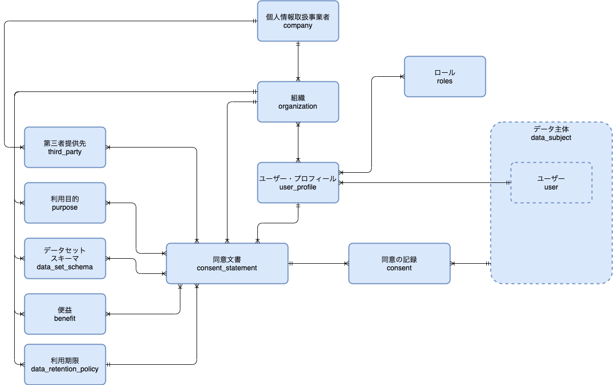

# Scalar IST
## Scalar Information-banking Solution Templare

Scalar Information-banking Solution Template(Scalar IST)は、データ主体による同意を記録し、データ収集、利用目的、第三者提供先、利用期限、およびデータ主体に対する開示に係わる同意、その証跡を保全することを目的としています。

パーソナルデータをデータ主体から取得するに当たって、プライバシーポリシー(利用規約に、プライバシーポリシーが記載されている場合は利用規約)を提示し、データ主体の同意を記録した上で、データの提供を受ける必要があります。

コンシューマーは企業にデータを提供すると、そのデジタルデータに対するコントロールを行えないため、同意は、サイバー空間において、基本的人権を守るために重要であるが、GDPR, CCPA, 情報銀行のような、パーソナルデータの保護に対する新しいトレンドがはじまっており、このため企業は、パーソナルデータの収集、利用、保存、提供に対して新しいリスクを抱えるようになっています。

Scalar ISTによって、データ主体の同意に基づくデータ収集、利用、保存、提供の記録の保全を行う事により、前述のリスクに対応することが出来ます。

# Scalar DLT
Scalar DLTは、Scalar社が提供するプロダクトであり、Scalar ISTの実行基盤であり、コントラクトによる改ざん検知が可能なアセットに対する操作と、ファンクションによる検索用のDBの操作を行う事が出来ます。

Scalar ISTはScalar DLT環境での実行を前提に実装されているため、Scalar ISTの実行にはScalar DLT環境が必須です。

Scalar DLTについては、[Scalar DLT基礎](docs/basics_of_scalar_dlt.md)に記載しています。

# Scalar ISTの概要
Scalar ISTは、データ主体による同意の記録と同意の対象となる同意文書を記録する、Scalar DLT上で動作するライブラリです。

ライブラリは、処理を実行するコントラクトとファンクションのJavaファイル、動作を定義するJson形式の設定ファイル、ISTのデプロイを行うツールで構成されており、Scalar DLTにデプロイすることで使用が可能となります。

## コントラクトとファンクションのJavaファイル
Scalar ISTが提供する、データ主体の同意に基づくデータ収集、利用、保存、提供の記録の保全を行うためのプログラムです。

## 設定ファイル
コントラクトの実行を制御するためJson形式の設定ファイルです。設定ファイルにはコントラクト実行時に使用する内容を記述し、コントラクト登録時に登録します。

## デプロイツール
ISTの実行のためには、必要なコントラクト、ファンクション、設定ファイルを正しく登録する必要があり、登録作業を補助するためデプロイツールを用意しています。

# アクター
Scalar ISTでは、システム運用事業者、システムを利用する個人情報取扱事業者、パーソナルデータの提供を行うデータ主体のアクターを定義しています。

## システム運用事業者
システムのオーナーであり、運営を行う事業者。個人情報取扱事業者の管理を行います。

## 個人情報取扱事業者

個人情報の収集、加工、提供など、個人情報を扱った業務を行う事業者です。

データ主体に対して同意文書の提示をおこない、同意に基づく個人情報の処理を行うため、同意文書の作成、同意の記録の管理を行います。

## データ主体
個人情報の所有者である個人。同意文書への同意と、本人の情報の提供を行います。

# ロールモデル

## 個人情報取扱事業者のロール一覧

|カテゴリ|ロール名|英語|説明|
|--|--|--|--|
|個人情報保護|データ主体|Data Subject|情報の持ち主（情報の主体）。本人の情報の提供と同意を行う|
| |データ提供者|Provisioner|データ主体の依頼を受けて、本人に代わってデータを提供する。※同意は行えない|
| |情報管理者|Controller|個人データの処理の目的および手段を決定する|
| |情報処理者|Processor|個人データを処理する|
||データ保護責任者|Controller|情報管理者もしくは情報処理者が個人データ保護指針を遵守できているかの監視等を行う|
||データ受領者|Processor|第三者としてデータを受領する|
|システム利用事業者|管理者|Admin|自事業者のアカウントを登録・削除を行う。|
||システム運用者|Operator|他システムへの接続を行う。|
||メンバー|Member|システムの自身のアカウントの登録・更新・削除を行う|
|システム運用事業者|システム管理者|SysAdmin|システム利用事業者の登録、更新、削除、システム利用事業者のアカウント管理者の登録、更新、削除等のシステム管理全般の業務を行う|
||システム運用者|SysOperator|システム起動・停止、アダプター開発・適用等、システム全般に係るオペレーションを行う|

## データモデル
ISTでは、アクターとして個人情報取扱事業者とデータ主体が存在します。

個人情報取扱事業者は事業者に所属するユーザーに該当するユーザープロファイルをもち、ユーザープロファイルは複数の組織に所属し、複数のロールを持ちます。
個人情報取扱事業者は複数の同意文書を持ち、同意文書は第三者提供先、利用目的、データセットスキーマ、便益、利用期限を紐付けて登録します。

データ主体は同意文書に対して同意、拒否の記録を行い、個人情報取扱事業者はデータ主体の同期の記録をもとに、個人情報の収集、処理、第三者提供先への提供を行います。

データモデルの関連を以下に示します。

# 機能一覧
IST実装しているコントラクト、ファンクション設計書およびアセットの構造、テーブルスキーマは[Contract/Function設計書](./docs/IST_Contract_and_Function.pdf)に記載しています。

# 利用手順
Scalar ISTの利用のためには、Scalar DLT環境の構築と、Scalar ISTのデプロイが必要です。

Scalar DLT環境の構築手順は [環境構築](docs/infrastructure.md) を参照して下さい。

Scalar ISTの実行手順は、[ユーザーストーリー、およびデプロイツールを使ったデプロイ手順](docs/how_to_use.md) を参照して下さい。

