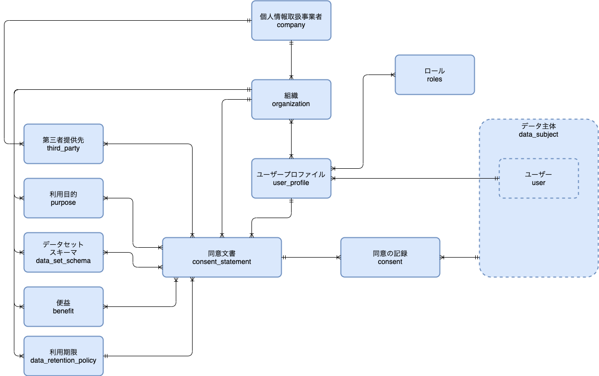

# Scalar IST
Scalar IST は、個人情報を取り扱う事業者がパーソナルデータを収集し、利用するために必要になる「同意の記録」を行うシステムを、Scalar DLT で構築するためのテンプレート・ライブラリです。 
Scalar IST は、個人情報保護法、GDPR、CCPAなどの法規への準拠に必要な基本機能を有しています。

Scalar IST は、以下の業務に対する記録を行い証跡を保全します。
- 個人情報取扱事業者による同意文書の登録、修正、改訂
- 個人情報取扱事業者による同意文書に関連するマスター（利用目的、データ項目、利用期限、第三者提供先）の登録
- データ主体による同意・同意の拒否・同意の撤回・部分同意

テンプレート・ライブラリでは、上記を実現するために、以下のものが提供されます。
- 同意文書の登録・修正・改訂を行う Scalar DLT のスマートコントラクト
- 同意文書に同意の記録を行う Scalar DLT のスマートコントラクト
- 検索用データ、記録要件が求められない更新可能なデータを格納するための Scalar DB のスキーマ
- コントラクト実行時に Scalar DB のデータを更新するプログラム

## Scalar IST が想定する利用形態
Scalar IST では、次の二つの業務のシステムを構築することが可能です。
- 個人情報の収集に関わる同意管理
- 個人情報の活用・提供に関わる同意管理、証跡管理（※ 今後対応予定）
- 情報銀行による同意管理、証跡管理（※ 今後対応予定）

Scalar IST では、次の二つの利用形態のシステムを構築することが可能です。
- 個人情報取扱事業者が自ら運用するシステムへの組み込み
- 複数の個人情報取扱事業者を対象としたサービスを提供するシステムへの組み込み

### 今後対応予定の機能
Scalar IST では、上記の機能に加え、今後以下の機能を提供することを予定しております。
- データ利用の記録
- データ提供の記録
- 包括同意の登録、包括同意にもとづく同意・撤回・修正の記録
- Cookie 同意を行うためのライブラリ

### 用語
|用語              |説明                                            |
|:----------------|:----------------------------------------------|
|データ主体         |パーソナルデータを保有する自然人                      |
|個人情報取扱事業者  |パーソナルデータを収集・保管・活用する事業者              |

|機能名     |説明                                            |
|:---------|:----------------------------------------------|
|アセット     |Scalar DLT 内の改ざん検知可能な台帳に記録されるデータ   |
|コントラクト  |Scalar DLT のアセットを操作するためのプログラム          |
|ファンクション |Scalar DB 内のデータを登録・更新・削除するためのプログラム |

# Scalar IST の想定するシステムの利用者と役割
Scalar IST を利用するユーザーには以下のようなものがあります。
- システム運用時業者
- 個人情報取扱事業者
- データ主体

## システム運用事業者
システムのオーナーであり、運営を行う事業者。個人情報取扱事業者の管理を行います。

## システム運用事業者
システム運用時業者は、Scalar IST によって構築されたシステムの利用事業者の管理、ユーザー管理、システムの起動・停止・アダプター開発・保守運用を行います。

### システム管理者(SysAdmin)
システム利用事業者の登録、更新、削除、システム利用事業者のアカウント管理者の登録、更新、削除等のシステム管理全般の業務を行う

### システム運用者(SysOperator)
システム起動・停止、アダプター開発・適用等、システム全般に係るオペレーションを行う

## 個人情報取扱事業者
データ主体から個人情報の収集、処理、第三者提供を行うため、個人情報の処理の目的および手段を定義する同意文書を作成します。
作成した同意文書をデータ主体に提示し、同意文書への同意に基づき個人情報の収集、処理、第三者提供を行います。
自身の事業者、および第三者提供先事業者の情報管理者もしくは情報処理者が個人情報保護指針を遵守できているかの監視等を行います。

### 個人情報取扱事業者の管理者(Admin)
自事業者内のアカウントを登録・削除を行う

### 個人情報取扱事業者の情報管理者(Controller)
個人情報の処理の目的および手段の決定、および情報管理者もしくは情報処理者が個人情報保護指針を遵守できているかの監視等を行う

### 個人情報取扱事業者の情報処理者（Processor）
個人情報取扱事業者、または第三者提供先に所属し、個人情報を処理する

## データ主体(Data Subject)
個人情報の所有者である個人。個人情報取扱事業者から提示された同意文書への同意、同意に基づく本人の個人情報の提供を行います。

# Scalar IST が提供するもの

## 機能
ISTが提供するコントラクト、ファンクション設計書およびアセットの構造、テーブルスキーマは[Contract/Function設計書](./docs/IST_Contract_and_Function.pdf)に記載しています。

## データモデル
ISTでは、アクターとして個人情報取扱事業者とデータ主体が存在します。

個人情報取扱事業者は事業者に所属するユーザーに該当するユーザープロファイルをもち、ユーザープロファイルは複数の組織に所属し、複数のロールを持ちます。
個人情報取扱事業者は複数の同意文書を持ち、同意文書は第三者提供先、利用目的、データセットスキーマ、便益、利用期限を紐付けて登録します。

データ主体は同意文書に対して同意、拒否の記録を行い、個人情報取扱事業者はデータ主体の同期の記録をもとに、個人情報の収集、処理、第三者提供先への提供を行います。

データモデルの関連を以下に示します。

## コントラクトとファンクションのJavaファイル
Scalar ISTが提供する、データ主体の同意に基づくデータ収集、利用、保存、提供の記録の保全を行うためのプログラムです。

## 設定ファイル
コントラクトの実行を制御するためJson形式の設定ファイルです。設定ファイルにはコントラクト実行時に使用する内容を記述し、コントラクト登録時に登録します。

## デプロイメントツール
ISTの実行のためには、必要なコントラクト、ファンクション、設定ファイルを正しく登録する必要があり、登録作業を補助するためデプロイツールを用意しています。

# 利用手順
Scalar ISTの利用のためには、Scalar DLT環境の構築と、Scalar ISTのデプロイが必要です。

Scalar DLT環境の構築手順は [環境構築](docs/infrastructure.md) を参照して下さい。

Scalar ISTの実行手順は、[ユーザーストーリー、およびデプロイツールを使ったデプロイ手順](docs/how_to_use.md) を参照して下さい。

# Scalar DLT
Scalar DLTは、Scalar社が提供するプロダクトであり、Scalar ISTの実行基盤であり、コントラクトによる改ざん検知が可能なアセットに対する操作と、ファンクションによる検索用のDBの操作を行う事が出来ます。

Scalar ISTはScalar DLT環境での実行を前提に実装されているため、Scalar ISTの実行にはScalar DLT環境が必須です。

Scalar DLTについては、[Scalar DLTの用語、および実行コマンドの説明](docs/basics_of_scalar_dlt.md)に記載しています。

