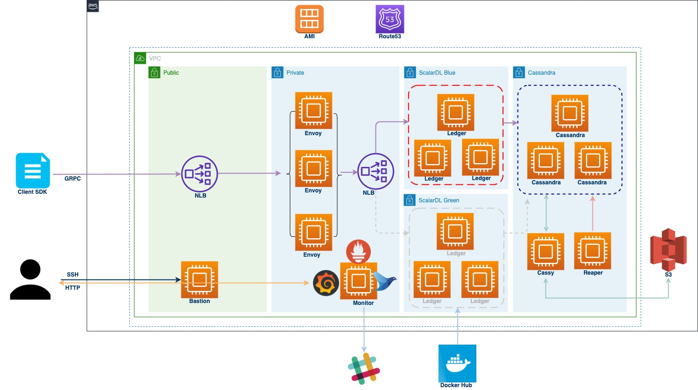
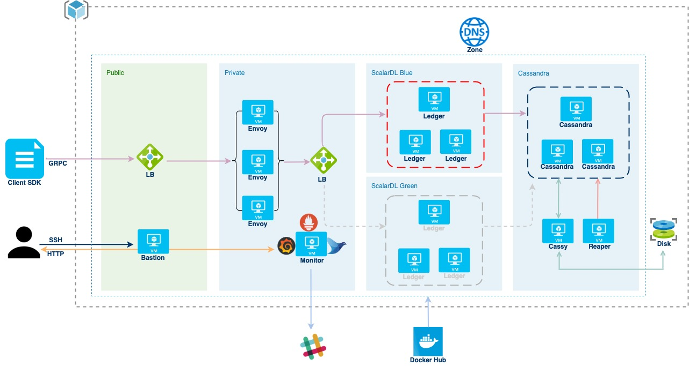

# Scalar IST 実行環境の構築方法

Scalar ISTのコントラクト/ファンクションを実行するためには、Scalar DLT環境が必要です。
Scalar DLT環境の構築には、Scalar Terraformを使ったクラウドサービス上での環境構築方法と、Docker Composeを使った簡易な方法があります。

Scalar DLTの使用には、別途 Scalar DLT のライセンスを購入する必要がありますので、弊社までお問い合わせ下さい。

## Scalar DLT 環境

Scalar DLT 環境は、AWS または Azure 上に構築することが出来ます。

AWS に構築した環境の構成図は以下の様になります。

Azure に構築した環境の構成図は以下の様になります。

## 環境構築の事前準備
環境構築時に使用する Scalar DLT のDockerイメージは、Docker-Hub の Private Repository に格納しているため、使用のためには Docker-Hub ユーザーへの参照権限付与が必要です。権限の付与は Scalar DLT のライセンス購入時に行います。

# Scalar Terraformを使った環境構築

Terraformを使用しクラウドサービス上でのScalar DLT環境の構築を行います。
Terraformのスクリプトは以下のリポジトリに格納しています。

https://github.com/scalar-labs/scalar-terraform

# Docker Composeを使った環境構築

Scalar DLT の Dockerイメージを使用したScalar DLT環境の構築を行います。

Dockerイメージを使った環境構築手順は以下に記載しています。
https://scalardl.readthedocs.io/en/latest/installation-with-docker/

